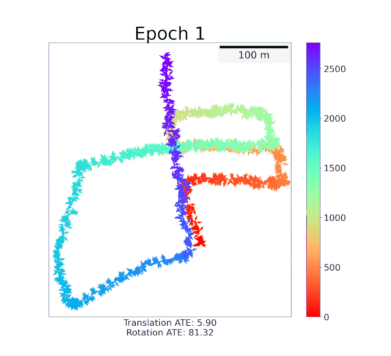
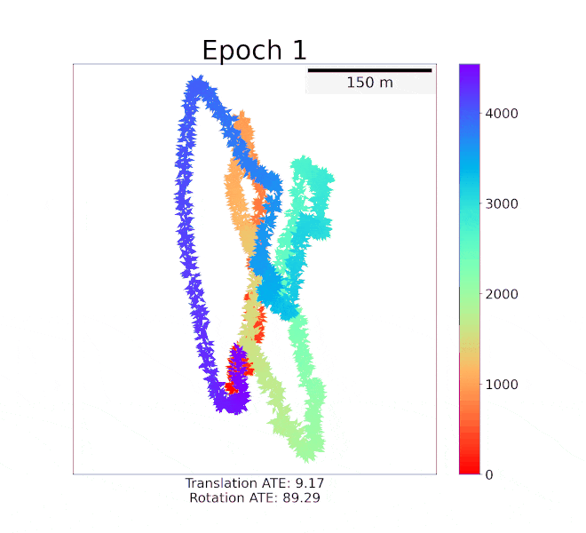

# DeepMapping2: Self-Supervised Large-Scale LiDAR Map Optimization

[Chao Chen](https://joechencc.github.io/)\*, [Xinhao Liu](https://gaaaavin.github.io/)\*, [Yiming Li](https://roboticsyimingli.github.io/), [Li Ding](https://www.hajim.rochester.edu/ece/lding6/), [Chen Feng](https://scholar.google.com/citations?user=YeG8ZM0AAAAJ)

<p align="center">


</p>

## News
**[2023-02]** Our paper is accepted by [CVPR 2023](https://cvpr2023.thecvf.com/).

**[2022-12]** Our paper is available at [arXiv](https://arxiv.org/abs/2212.06331) and the [project page](https://ai4ce.github.io/DeepMapping2/) is online.

## Abstract
LiDAR mapping is important yet challenging in self-driving and mobile robotics. To tackle such a global point cloud registration problem, DeepMapping converts the complex map estimation into a self-supervised training of simple deep networks. Despite its broad convergence range on small datasets, DeepMapping still cannot produce satisfactory results on large-scale datasets with thousands of frames. This is due to the lack of loop closures and exact cross-frame point correspondences, and the slow convergence of its global localization network. We propose DeepMapping2 by adding two novel techniques to address these issues: (1) organization of training batch based on map topology from loop closing, and (2) self-supervised local-to-global point consistency loss leveraging pairwise registration. Our experiments and ablation studies on public datasets (KITTI, NCLT, and Nebula) demonstrate the effectiveness of our method. Our code will be released.


# Getting Started:
## Installation
The code is tested with Python 3.9, PyTorch 1.13.1, and CUDA 11.6.

To install the dependencies, you can create a virtual environment with
```
conda create -n dm2 python=3.9
pip install torch==1.13.1 --index-url https://download.pytorch.org/whl/cu116
```
and then install the dependencies with
```
conda activate dm2
pip install -r requirements.txt
```

## Data Preparation
To download the dataset used for training and testing, please refer to [./data/README.md](./data/README.md)

## Usage
To train the model, execute the script
```
cd script/
./run_train.sh
```
The visualization and evaluation results will be saved in the `results` folder.

To use a different initial pose and pairwise registration, please edit `INIT` and `PAIRWISE` in the script to direct to the corresponding files.


## Citation
If you find this work useful for your research, please cite our paper:
```
@article{chen2022deepmapping2,
  title={DeepMapping2: Self-Supervised Large-Scale LiDAR Map Optimization},
  author={Chen, Chao and Liu, Xinhao and Li, Yiming and Ding, Li and Feng, Chen},
  journal={arXiv preprint arXiv:2212.06331},
  year={2022}
}
```
