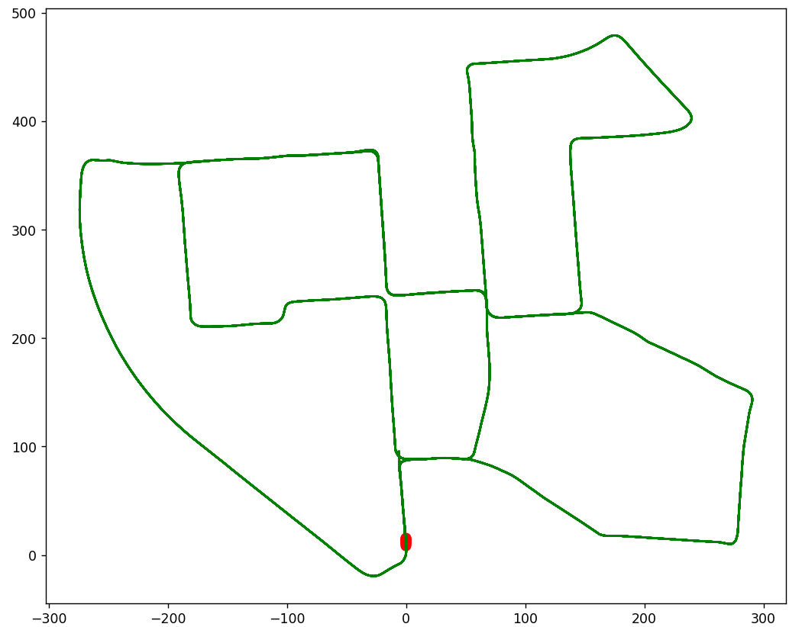
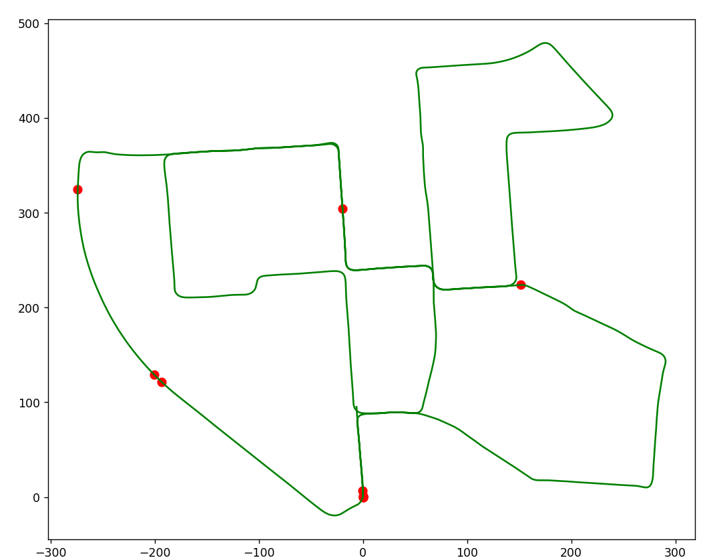
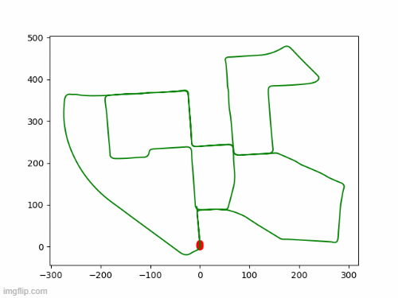

# Download
You can download the preprocessed data we used in the experiment from [Google Drive](https://drive.google.com/drive/folders/1jWfpmCAXaO9122mdkAuSV-yq_2DanPRh?usp=share_link)

# Custom Dataset

Follow the steps below to implement DeepMapping2 on a custom dataset.

## Step 1 : Organize your data
The data should be organized as follows:

```
data
|-- KITTI # Type of dataset
|   |-- 0018 # Trajectory number
|   |   |-- pcd # Point cloud data
|   |   |   |-- 000000.pcd
|   |   |   |-- 000001.pcd
|   |   |   |-- ...
|   |   |   |-- gt_pose.npy # Ground truth pose 
|   |   |-- prior # Prior data
|   |   |   |-- group_matrix.npy # Group matrix
|   |   |   |-- init_pose.npy # Initial pose
|   |   |   |-- pairwise_pose.npy # Pairwise registration
|   |-- 0027 
|   |-- ...
|-- NCLT
|-- NeBuLa
|-- ...
```
The ground truth pose should be in `x y z roll pitch yaw` format.
All point clouds should be present in `pcd` folder.
The files present in `prior` folder need to be generated.

## Step 2 : Generating the embeddings for your dataset
Any VPR (Visual Place Recognition) technique, such as [TF-VPR](https://github.com/ai4ce/TF-VPR) and [NetVLAD](https://github.com/Relja/netvlad), can be used to generate the embeddings.

Following are the steps to generate embeddings using TF-VPR/NetVLAD method using the [TF-VPR](https://github.com/ai4ce/TF-VPR) repository:-


1. Put data and ground_truth in appropriate directories
2. Generate pickle files for training and evaluation
    For TF-VPR
    ```
    a. python generate_training_tuples_PCL_ours.py
    b. python generate_test_PCL_ours_sets.py
    ```
    For NetVLAD
    ```
    a. python generate_training_tuples_PCL_supervise.py
    b. python generate_test_PCL_supervise_sets.py
    ```
3. Generate min and max thresholds for all point clouds
    ```
    python Verification_PCL.py
    ```
4. Train the model
    a. To train TF-VPR
    ```
    python train_pointnetvlad_PCL_ours.py
    ```
    b. To train NetVLAD
    ```
    python train_pointnetvlad_PCL_supervise.py
    ```
5. Get the 256-dimensional embeddings
    ```
    a. python get_embeddings_ours.py
    ```

## Step 3 - Generating initial pose
1. Load all point clouds
2. Perform ICP between two consecutive point clouds
3. Get R, t and estimate entire trajectory
4. Store `x, y, z, roll, pitch, yaw`
5. Save as - `init_pose.npy`
6. This initial pose can also be calculated using other sources such as GPS, Odometry, and IMU.

`init_pose.npy` should be an Nx6 numpy array, where N is the number of frames. Each row is the initial pose of a frame represented by `x, y, z, row, pitch, yaw`.

Following is an example pose initialized using ICP
<p align="center">

</p>


## Step 4 - Generating the group matrix
1. Apply KNN on the embeddings and get nearest neighbors atleast twice the size of the intended group size. Group size is the size of the group matrix i.e. number of neighbors an anchor should have for training. This is a list of potential neighbors of a particular anchor which needs further filtering to remove **FALSE POSITIVES**.
2. Keep only those neighbors whose distance to the anchor is less than a threshold. This threshold is basically the distance between the anchor and it's potential neighbor within which the neighbor will be considered a **TRUE POSITIVE**. A value of 10 (meters) should be a good starting point. This rough distance information can be obtained from the ICP initialization performed in `Step 3` if GPS is not provided.
3. Append temporal neighbors, if neighbor length is less than intended group size
4. Keep nearest neighbors, if neighbor length is greater than intended group size
5. Verify that there are **NO FALSE POSITIVES** at all
6. Format - the first ID is the anchor itself followed by the neighbor IDs
7. Save as - `group_matrix.npy`
8. This group matrix can also be constructed using other input sources such as GPS.

Following is an example of a **TRUE POSITIVE** - true neighbors clustered around the anchor
<p align="center">

</p>

Following is an example of a **FALSE POSITIVE** - few false neighbors distributed around the trajectory
<p align="center">

</p>

Following is an example of a section of trajectory with no false positives
<p align="center">

</p>


## Step 5 - Generating pairwise pose
1. `Perform ICP between anchor and each of its neighbors`
2. Get R, t 
3. Convert to `x, y, z, roll, pitch, yaw`
4. Save as - `pairwise_pose.npy`

`pairwise_pose.npy` should be an NxMx6 numpy array, where N is the number of frames, M is the number of neighbors of each frame. This should correspond to the shape of `group_matrix.npy`. The last dimension is the pairwise transformation from the neighbor to the center represented by `x, y, z, row, pitch, yaw`.

We provide a script `pre_processing_custom.py` that performs steps 3, 4, and 5 for you, provided the path to the dataset and the embeddings.

To generate the three pre-processing files, appropriately change the parameters and execute script
```
run_pre_processing_custom.sh
```
